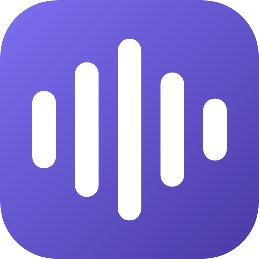

# iTunes-RPC

Shows what's playing as a Discord activity: "Listening to `<artist>`", with
live album art, track number, and a progress bar. Defaults to iTunes, also
works with VLC, browsers, and any other app that reports now-playing info
to Windows. Runs as a tray icon with a Settings window.

> Built with the help of [Claude Code](https://claude.com/claude-code)
> (Anthropic's AI coding agent).

## Install

1. Create a Discord application at
   [discord.com/developers/applications](https://discord.com/developers/applications)
   and copy the Application ID.
2. Download `iTunes-RPC.zip` from the
   [latest release](../../releases/latest) and extract it.
3. Run `install.bat`. It asks whether to start at login, then installs.

Installs to `%LOCALAPPDATA%\iTunes-RPC`. On first run, the tray icon opens
Settings automatically so you can paste the Application ID.

Re-running `install.bat` from a newer release upgrades in place and keeps
your settings.

## Uninstall

Run `uninstall.bat` from the same folder, or uninstall it like any other
app from Windows Settings > Apps > Installed apps. Either way, this stops
the app, removes the autostart shortcut, and deletes the installed files.

## Settings

Right-click or double-click the tray icon to open Settings:

- Discord Application ID (masked, with a hold-to-reveal Show button and a
  Paste button)
- Media source: iTunes, or any other app currently reporting now-playing
  info to Windows (Spotify excluded; it has its own Discord integration)
- Broadcast on/off
- Show track number on/off
- Album art: automatic lookup, a custom image URL, or a static logo only
- Poll interval
- Start at login

Changes apply immediately on Save; the window stays open.

## Build from source

```
dotnet run --project src\iTunesRPC
```

Standalone exe:

```
dotnet publish src\iTunesRPC -c Release -r win-x64 --self-contained false
```

Output: `src\iTunesRPC\bin\Release\net8.0-windows10.0.19041.0\win-x64\publish\`.

Requires Discord running, checked at runtime.

## How it works

- iTunes: polls over COM every 2 seconds for the current track and
  position. Other apps: reads Windows' System Media Transport Controls.
- Sends the track to Discord as a "Listening to" Rich Presence activity.
- Looks up cover art via Apple's iTunes Search API (album, then track).
- Shows the artist in Discord's compact status tag next to your username.

## Known limitations

- The "Listening to" wording isn't officially supported for third-party
  apps and could change in a future Discord update.
- Album art requires a match on Apple's catalog. Unreleased or mistagged
  tracks fall back to a static logo.
- Album art can still disappear intermittently on long sessions. See
  [issue #1](../../issues/1).
- Track number is only available from iTunes; other media sources don't
  report it.
